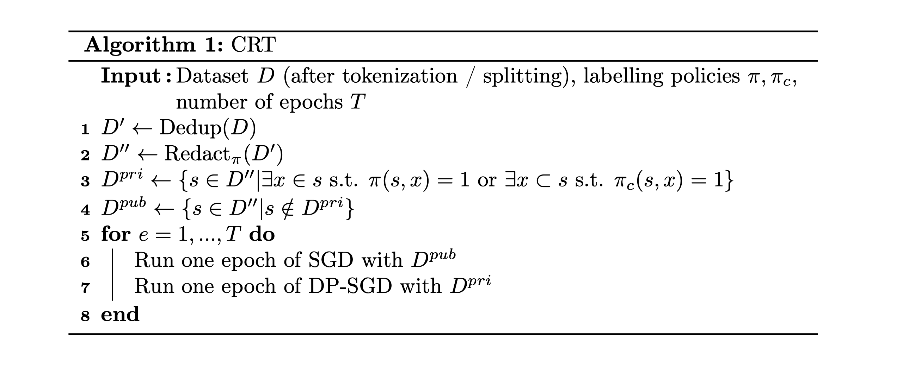

# Provably Confidential Language Modelling

> Provably Confidential Language Modelling  
> [Xuandong Zhao](https://xuandongzhao.github.io/), [Lei Li](https://sites.cs.ucsb.edu/~lilei/), [Yu-Xiang Wang](https://sites.cs.ucsb.edu/~yuxiangw/)  
> NAACL 2022 (Oral)

### [Paper](https://arxiv.org/abs/2205.01863)

We propose **Confidentially Redacted Training (CRT)**, a method to train language generation models while protecting the confidential segments.  We borrow ideas from differential privacy and show that our method is able to provably prevent **unintended memorization** by randomizing parts of the training process. Moreover, we show that **redaction** with an approximately correct screening policy **amplifies the confidentiality guarantee**. 

A pseudo-code of the algorithm:


An illustration of our proposed algorithm on a dataset with two data points:


## Citation

Please cite our paper if you find CRT useful for your research:

```bibtex
@inproceedings{zhao-etal-2022-provably,
  title={Provably Confidential Language Modelling},
  author={Zhao, Xuandong and Li, Lei and Wang, Yu-Xiang},
  booktitle={Proceedings of the 2022 Conference of the North American Chapter of the Association for Computational Linguistics: Human Language Technologies},
  year={2022}
}
```

